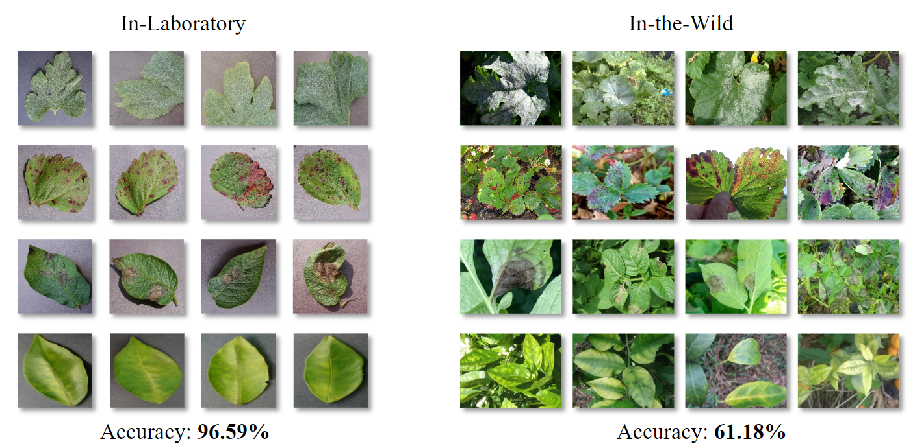

Plant disease recognition is essential in the agriculture field. Crops often face threats from diseases caused by bacteria, pests, and viruses. According to The Food and Agriculture Organization of the United Nations, annual losses can reach about 220 billion dollars due to plant diseases. Accurate recognition of plant diseases is essential to mitigate damage and prevent the spread of these diseases.

Recently, deep learning methods have achieved promising performance on in-laboratory images. However, they would suffer large performance degradation on in-the-wild images, which are captured in fields. As presented in the following figure, each in-laboratory image only contains one leaf and has a uniform background. On the contrary, in-the-wild images have complex backgrounds, different viewpoints, and lighting conditions. Therefore, in-the-wild images pose a greater challenge in classification tasks comparing to in-laboratory images.

  

If you think the work is helpful, don't forget to give me a star. :star2:

---
