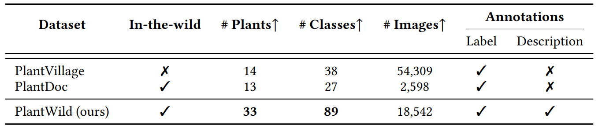

**Data Statistics of PlantWild**

  

The PlantWild dataset is accessible through:

* [Google Drive Download Link](https://drive.google.com/file/d/1s7FOoztTHvO03yVfw75pQY_kzZqvAckD/view?usp=drive_link)
* [UQRDM](https://cloud.rdm.uq.edu.au/index.php/s/5iTzoyby9Xobmq2)

## Copyright:

Our dataset follows the copyright [Creative Commons BY-NC-ND 4.0 license](https://creativecommons.org/licenses/by-nc-nd/4.0/).

