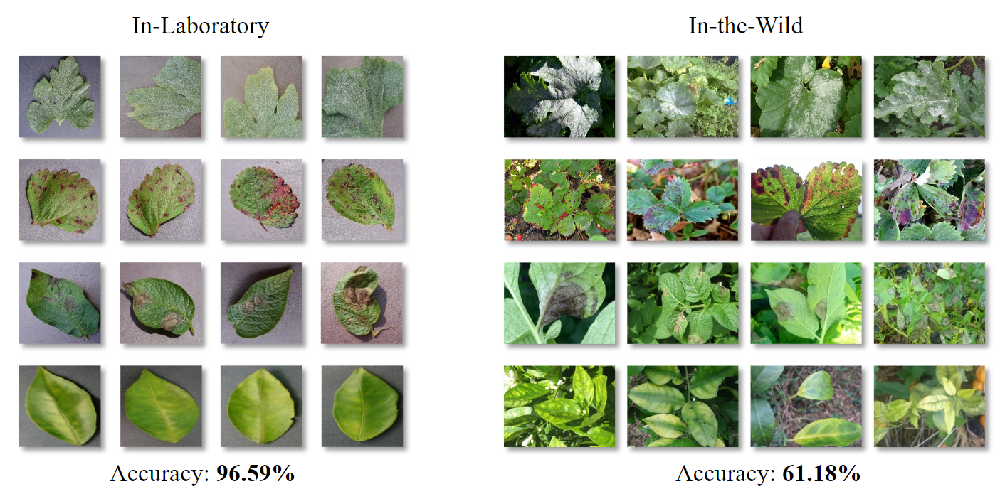

**Plant disease recognition** is essential in the agriculture field. Crops often face threats from diseases caused by bacteria, pests, and viruses. According to The Food and Agriculture Organization of the United Nations, annual losses can reach about 220 billion dollars due to plant diseases. Accurate recognition of plant diseases is essential to mitigate damage and prevent the spread of these diseases.

**Deep learning** methods have achieved promising performance on in-laboratory images. However, they would suffer large performance degradation on in-the-wild images, which are captured in fields. As presented in the following figure, each in-laboratory image only contains one leaf and has a uniform background. On the contrary, in-the-wild images have complex backgrounds, different viewpoints, and lighting conditions. Therefore, in-the-wild images pose a greater challenge in classification tasks compared to in-laboratory images.
However, to the best of our knowledge, there is no publicly available large-scale in-the-wild plant disease image dataset. To meet the practical needs in the real world, we curate a large-scale in-the-wild plant disease dataset, named PlantWild.

  

**PlantWild** contains the largest number of in-the-wild images compared to existing datasets and has the largest number of disease classes. In addition, it also provides text-based descriptions for each disease. The newly provided text descriptions are introduced to provide rich information in textual modality and benefit facilitating in-the-wild disease classification

---
